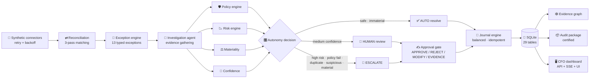

<div align="center">

# ✈️ FinPilot

### Autonomous Month-End Close Agent

**Close the books. Not just chat about them.**

*Track 2 — Autonomous Office of the CFO*


-f5b544)


</div>

---

FinPilot is a **working** month-end close system — not a chatbot, not a mockup. It ingests
synthetic bank + ERP feeds, reconciles bank against ledger, detects and investigates
exceptions, scores every case through **policy → risk → materiality → confidence** engines,
**auto-resolves** safe items under a configurable autonomy policy, **pauses for human
approval** on material or risky ones, posts **balanced, idempotent journal entries**, and
produces a CFO summary plus a **certified, evidence-linked audit package** — all persisted
in a real database and driven through a real API and a real UI.

> Every number on screen comes from the database. Every agent action is a persisted,
> auditable event. No fake buttons. No hardcoded dashboards. No fabricated metrics.

---

## ✨ What it does

| Capability | How it works |
|---|---|
| 🏦 **Ingestion** | Synthetic bank & ERP connectors with **retry + exponential backoff**; idempotent batch cursors |
| ⇄ **Reconciliation** | 3-pass deterministic matching: exact reference → amount/date/counterparty → fuzzy within 1.5% |
| 🚨 **Exception engine** | 13 typed exceptions (amount mismatch, duplicates, missing entries, FX, policy violation, suspicious…) |
| 🔎 **Investigation agent** | Gathers real evidence: invoice, PO, contract, processor report, 3-month history, GL, policy |
| 🛡 **Decision core** | LLM-free, deterministic: policy engine → risk engine → materiality → confidence → autonomy decision |
| 🎛 **Controlled autonomy** | `AUTO` (≥97% conf, low risk, policies pass, immaterial) · `HUMAN` review · `ESCALATE` |
| ✍️ **Human-in-the-loop** | APPROVE / REJECT / MODIFY / REQUEST EVIDENCE — workflow persists, pauses, resumes from checkpoint |
| 📒 **Journal engine** | Dr = Cr enforced pre- and post-persistence; unique idempotency keys make double-posting impossible |
| 🕸 **Evidence graph** | Vendor → Contract → PO → Invoice → Payment → Bank Txn → GL → Journal → Policy, explorable in the UI |
| 🤖 **CFO Copilot** | Grounded Q&A over close data with cited facts — no hallucinated numbers |
| 📦 **Audit package** | 9 sections, certified, every conclusion linked to evidence IDs; downloadable as Markdown |
| 🔐 **RBAC + audit trail** | CFO / Controller / Accountant / Auditor roles enforced server-side; every decision logged |

---

## 🎬 The demo story (all four mandatory cases)

| Case | Scenario | Agent behavior |
|---|---|---|
| **A** | CloudScale India invoice `INV-2841`: ₹5,00,000 invoiced, **₹4,82,000 settled** | Investigates, identifies the **₹18,000 payment-processing fee** (processor report + 3-month fee history), proposes a balanced fee/GST/cash journal, **auto-resolves at 98% confidence** |
| **B** | Material ₹18,40,000 true-up accrual; policy: JEs > ₹10,00,000 need Controller approval | **Pauses the workflow**, requests CONTROLLER approval, resumes from checkpoint on approval, posts the journal |
| **C** | Duplicate invoice `INV-7721` (₹4,20,000 × 2) | Detects, **escalates — never auto-posts** |
| **4** | Bank connector timeout | Retries with **exponential backoff**, resumes safely from checkpoint — **zero duplicate ingestion or posting** |

All data is deterministic under `FINPILOT_DEMO_SEED=2026` — **RESET DEMO** restores the exact
initial state, and the complete demo runs without any real bank/ERP credentials.

---

## 🚀 Quick start

```bash
git clone https://github.com/ABHISHEK-DBZ/fin-pilot.git
cd fin-pilot
npm install        # zero runtime dependencies
npm run seed       # migrate + seed deterministic demo data (seed 2026)
npm start          # → http://localhost:4310
npm test           # 33 unit tests + 24 E2E checks
```

**Requirements:** Node.js ≥ 22.5 (uses the built-in `node:sqlite` module — no native
compilation, no external database). A PostgreSQL profile is included for
production-style deployment via `docker-compose.yml` (`--profile pg`).

### 5-minute walkthrough

1. Open **http://localhost:4310** → pick a role (CFO, Controller, Accountant, Auditor)
2. **Start September Close** → watch the orchestrator run live (checkpoints after every task)
3. The run **pauses at the ₹18,40,000 accrual** → switch to Controller → **APPROVE** → watch it complete
4. Open **EXC-0026** in Exceptions → explore the finding, policy results, proposed journal, and **evidence graph**
5. Download the **certified audit package** from the Audit page
6. **RESET DEMO** to replay from scratch

---

## 🏗 Architecture

**Financial safety is the design constraint: an LLM never touches financial records, and
agents never see SQL.** All mutations flow through a typed tool executor with persisted
input/output summaries, and the decision core is deterministic and fully explainable.



### Safety invariants

- **Journals are validated twice** — before persistence and again at posting (balance
  re-verified from the line items, the source of truth)
- **Idempotency keys have a unique index** — repeated execution can never duplicate a
  financial mutation; connector refetches and workflow replays are safe
- **Only material approvals pause the workflow** — other reviews wait in a queue, the way
  real finance teams work
- **Every agent action is persisted** as `agent_runs`, `agent_steps`, and `agent_actions`
  with input/output summaries — the Agent Activity page shows the real events

---

## 🧪 Reliability

```bash
npm test   # → ALL SUITES PASSED
```

| Suite | Coverage |
|---|---|
| **33 unit tests** | matching (exact/fuzzy/tolerance/no-double-consumption) · duplicate detection · journal balancing, validation, idempotent create + post · risk bounds & monotonicity · materiality · confidence · policy rules (controller threshold, duplicate block) · autonomy paths (AUTO/HUMAN/ESCALATE) · connector retry/backoff · seeded invariants (spec minimums, Case A amounts, SYNTHETIC labeling) · evidence-graph linkage |
| **24 E2E checks** | full close COMPLETED @ 100% · Case A auto-resolved with balanced posted JE · Case B CONTROLLER pause → approve → posted · Case C escalated → rejected → never posted · connector recovery without duplicate ingestion · all journals balanced · no duplicate idempotency keys · audit package certified with all 9 sections · grounded CFO summary |

Plus: input validation, structured logs, safe error handling, checkpoint/resume recovery,
and workflow replay — exercised by the demo's own connector-failure case.

---

## 📁 Project structure

```
fin-pilot/
├── packages/
│   ├── shared/            domain types + money utilities
│   ├── database/          29-table schema, migrations, deterministic seed, policy loader
│   ├── finance-engine/    connectors · reconciliation · exceptions · journal engine
│   ├── policy-engine/     policy rules · autonomy decision engine
│   ├── risk-engine/       risk scoring · materiality · confidence
│   ├── agents/            investigation agent · CFO copilot (grounded)
│   ├── evidence-graph/    financial entities + relationships + neighborhood queries
│   └── workflow/          typed tool executor · orchestrator · metrics · audit package
├── apps/
│   ├── api/               HTTP + SSE server, RBAC, static hosting (zero deps)
│   └── web/               enterprise CFO UI (vanilla JS SPA)
├── data/                  SQLite DB · demo policies (YAML) · fixtures
├── tests/                 unit + E2E suites (npm test)
└── docs/                  AO build log — actual AI-assisted development evidence
```

---

## ⚙️ Configuration

| Variable | Default | Purpose |
|---|---|---|
| `FINPILOT_DEMO_SEED` | `2026` | Deterministic demo data seed |
| `PORT` | `4310` | API + UI port |
| `FINPILOT_DB_PATH` | `data/finpilot.db` | SQLite database location |
| `FINPILOT_LLM_PROVIDER` | *(unset = deterministic)* | Optional narrative phrasing only — every number and evidence link comes from the database |

Autonomy thresholds are **live-configurable** from the Policies page (CFO role) or
`data/policies/demo_policies.yaml` — auto-resolve confidence, review floor, approval
thresholds, duplicate blocks, and more.

---

## 🔐 Demo roles (RBAC, enforced server-side)

| Role | User | Permissions |
|---|---|---|
| **CFO** | Priya Menon | everything — approvals, policy edits, demo reset |
| **Controller** | Rahul Verma | approvals, close start, reset |
| **Accountant** | Sneha Iyer | start close, request evidence |
| **Auditor** | Karan Rao | read-only, including the audit package |

> ⚠️ **All data in this repository is synthetic** and labeled as such throughout the UI.
> Nothing here connects to real banking or ERP systems, and the complete demo requires no
> external credentials.

---

## 📚 Documentation

- **[Build With AO log](docs/AO_BUILD_LOG.md)** — the actual AI-assisted development record:
  architecture iterations, 12 real bugs found and fixed, tests generated, decisions changed —
  with an explicit no-fabrication integrity statement

## 📄 License

[MIT](LICENSE)
